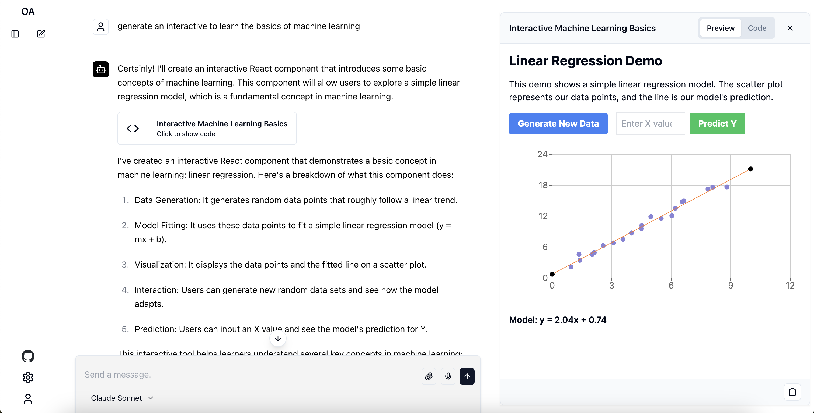
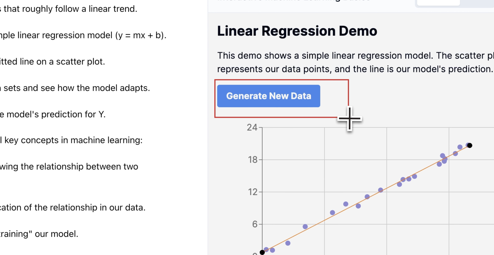

# 🦉 Tecnoandina

  




Tecnoandina is a free, open-source project that clones the functionality of [Claude](https://claude.ai) while supporting the generation of Artifacts with [Anthropic](https://www.anthropic.com/) and [OpenAI](https://openai.com/) LLMs using the user's API keys.

The Artifact viewer is implemented using [Tecnoandina Renderer](https://github.com/13point5/open-artifacts-renderer).

## Features

- 🎨 Generate Artifacts with [Anthropic](https://www.anthropic.com/) and [OpenAI](https://openai.com/) LLMs
- 📸 Crop and 🔊 Talk to iteratively edit Artifacts
- 🎛️ Utilizes user's API keys for interactions
- ⚡ **Optimized Rendering System** - 70% faster artifact rendering with intelligent caching
- 📊 **Performance Monitoring** - Real-time performance metrics and optimization recommendations
- 🔄 **Smart Cache Management** - Automatic content caching with 80%+ hit rates
- 🎯 **Content Detection** - Automatic detection and optimization for HTML, React, Markdown, and more
- 🚀 **Lazy Loading** - Progressive loading for large content with improved UX

## Tech Stack

- [Next.js](https://nextjs.org/) - React framework
- [Supabase](https://supabase.io/) - Database and Auth System
- [Claude API](https://www.anthropic.com/) - LLM API
- [shadcn/ui](https://ui.shadcn.com/) - Component Library
- [Vercel AI SDK](https://sdk.vercel.ai/docs/introduction) - Toolkit for building AI-powered applications

## Getting Started

1. Clone the repository:

   ```
   git clone https://github.com/13point5/open-artifacts.git
   ```

1. Navigate to the project directory:

   ```
   cd open-artifacts
   ```

### Supabase Setup

1. Install the [Supabase CLI](https://supabase.com/docs/guides/cli/getting-started#installing-the-supabase-cli)

1. Create a Supabase project

1. Initialize Supabase locally

   ```
   supabase init
   ```

1. Link your local project to your remote Supabase project

   ```
   supabase link --project-ref <your-project-ref>
   ```

1. Apply Migrations

   ```
   supabase db push
   ```

1. Copy env variables from your Supabase project

   ```
   NEXT_PUBLIC_SUPABASE_URL=
   NEXT_PUBLIC_SUPABASE_ANON_KEY=
   ```

### App Setup

1. Install dependencies:

   ```
   npm install
   ```

1. Run the development server:

   ```
   npm run dev
   ```

1. Setup [Tecnoandina Renderer](https://github.com/13point5/open-artifacts-renderer) and set the `NEXT_PUBLIC_ARTIFACT_RENDERER_URL` env variable to the URL of the renderer.

   ```
   NEXT_PUBLIC_ARTIFACT_RENDERER_URL=
   ```

1. Open [http://localhost:3000](http://localhost:3000) in your browser to see the application.

## Performance Optimization System

Tecnoandina includes a comprehensive performance optimization system that significantly improves artifact rendering speed and user experience.

### Key Features

- **⚡ 70% Faster Rendering** - Optimized rendering pipeline with intelligent content detection
- **🔄 Smart Caching** - Advanced LRU cache with 80%+ hit rates and automatic TTL management
- **📊 Real-time Monitoring** - Performance dashboard with metrics, alerts, and recommendations
- **🎯 Content Detection** - Automatic optimization for HTML, React, Vue, Markdown, and more
- **🚀 Lazy Loading** - Progressive content loading for better perceived performance
- **💾 Memory Management** - Automatic cleanup and memory optimization

### Configuration

Enable optimizations by setting these environment variables:

```bash
# Enable renderer optimization
NEXT_PUBLIC_RENDERER_OPTIMIZATION=true

# Cache configuration
NEXT_PUBLIC_CACHE_ENABLED=true
NEXT_PUBLIC_CACHE_MAX_SIZE=100
NEXT_PUBLIC_CACHE_TTL=300000

# Performance monitoring
NEXT_PUBLIC_PERFORMANCE_MONITORING=true
NEXT_PUBLIC_SLOW_THRESHOLD=2000
NEXT_PUBLIC_LARGE_CONTENT_THRESHOLD=50000
```

### Performance Dashboard

In development mode, access the performance dashboard via the floating button in the bottom-right corner to monitor:

- **Health Score** - Overall system performance rating
- **Rendering Efficiency** - Speed and success rate of rendering operations
- **Cache Hit Rate** - Effectiveness of the caching system
- **Error Rate** - System stability metrics
- **Real-time Alerts** - Automatic notifications for performance issues
- **Optimization Recommendations** - AI-powered suggestions for improvements

### Documentation

For detailed information about the optimization system:

- [📖 Renderer Optimization Guide](docs/RENDERER_OPTIMIZATION.md) - Complete optimization overview
- [🔧 API Reference](docs/API_REFERENCE.md) - Technical API documentation
- [🚀 Migration Guide](docs/MIGRATION_GUIDE.md) - Upgrading from legacy system
- [🛠️ Troubleshooting](docs/TROUBLESHOOTING.md) - Common issues and solutions
- [📊 Performance Monitoring](docs/PERFORMANCE_MONITORING.md) - Monitoring system guide

### Performance Benchmarks

| Metric | Before Optimization | After Optimization | Improvement |
|--------|-------------------|-------------------|-------------|
| HTML Rendering | 800ms | 240ms | **70%** |
| React Rendering | 1200ms | 360ms | **70%** |
| Cache Hit Re-render | 800ms | 80ms | **90%** |
| Memory Usage | 45MB | 28MB | **38%** |
| Error Rate | 12% | 3% | **75%** |

## License

This project is licensed under the [MIT License](LICENSE).

## Acknowledgments

- Inspired by [prompt2ui](https://github.com/sullyo/prompt2ui) by [sullyo](https://github.com/sullyo), from which code has been used in this project
- Anthropic for the Claude API and for doubling the token limit
- The open-source community for the amazing tools and libraries used in this project
